# Дополнительные материалы

Команда AI BOTS TEAEM · «Арена переговоров» · [прототип](https://lotos24.github.io/arenaAI-26/) · [документация](DOCUMENTATION.md) · [презентация PDF](presentation/Arena-AI-BOTS-TEAM.pdf)

## Демонстрация за 3–5 минут

1. Откройте https://lotos24.github.io/arenaAI-26/ в Chrome. Посмотрите легенду и тур по интерфейсу.
2. Нажмите «Демо: как это работает». Сыгранный кейс «Алабуга Политех» пройдёт за минуту: варианты в ленте, напряжённость, раскрытие интересов.
3. На разборе откройте:
   - «Итог» — что договорились и какой ценой;
   - «Судьи» — три вердикта с цитатами;
   - «Ход за ходом»;
   - памятку.
4. Начните «Первую встречу» и напишите свой ответ, например «Давайте обменяемся: если вы сдвинете срок на неделю, мы возьмём на себя тестирование». Собеседник ответит на названные условия.
5. Повторите встречу с давлением и доведите напряжённость до срыва на 100%.
6. В «Настройках» включите локальную нейросеть (нужен WebGPU). Модель Qwen2.5 загрузится в браузер и будет отвечать без сервера.
7. Откройте «Прогресс» (XP, звание, достижения) и «Администратор / Конструктор» (свой сценарий, библиотека, JSON).

## Скриншоты

| Экран | Файл |
|---|---|
| Легенда при первом запуске | 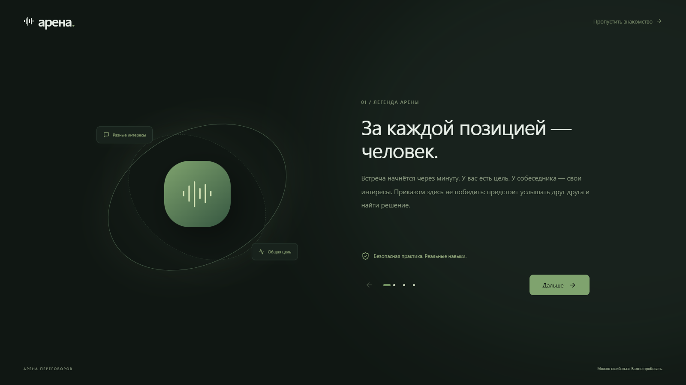 |
| Главная: «С чего начать» и карта | 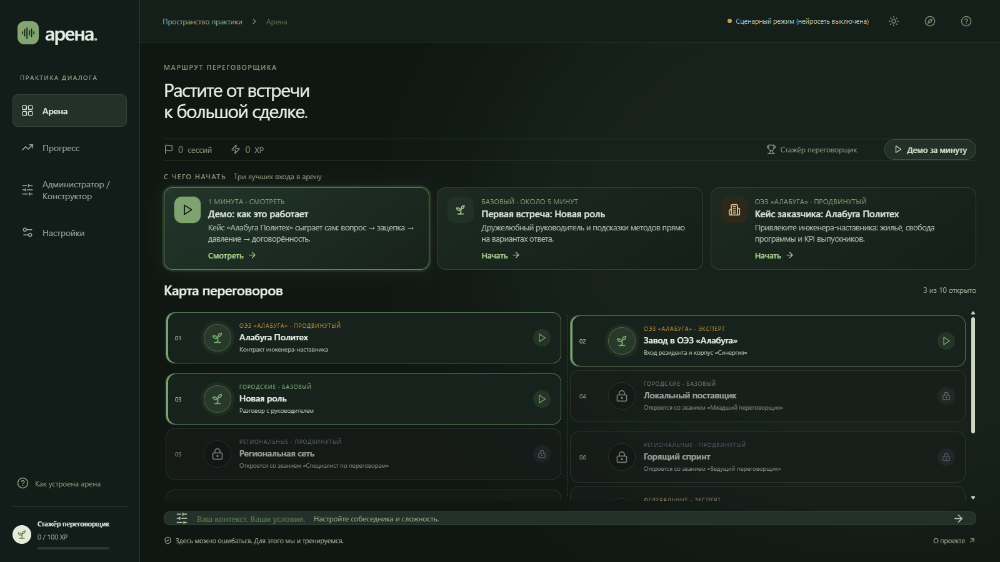 |
| Тур по интерфейсу | 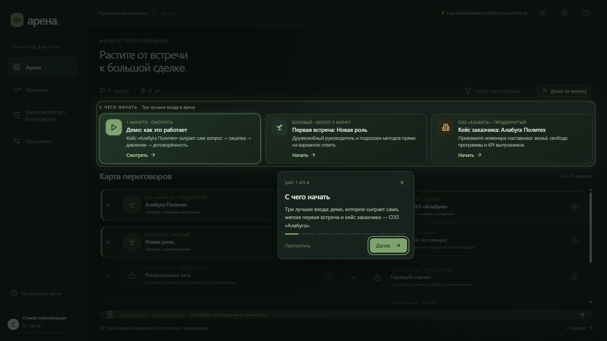 |
| Демо-диалог: варианты в ленте | 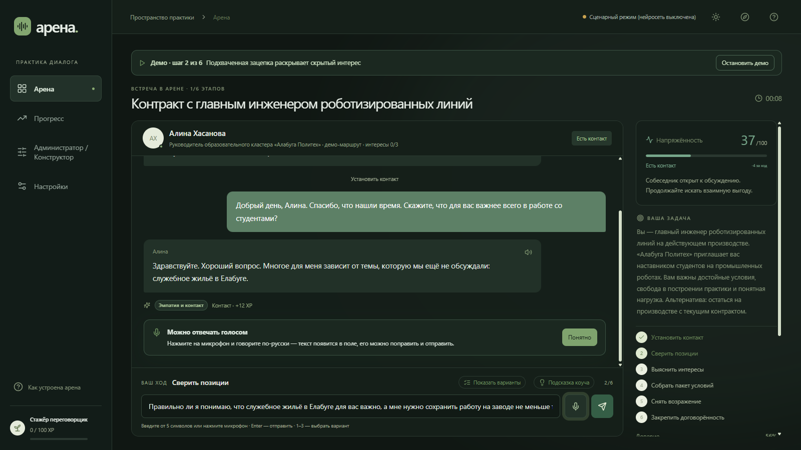 |
| Диалог: напряжённость и интересы | 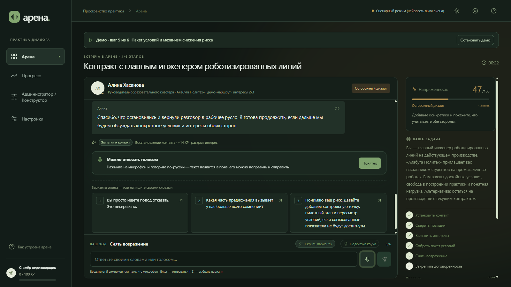 |
| Разбор: итог сделки | 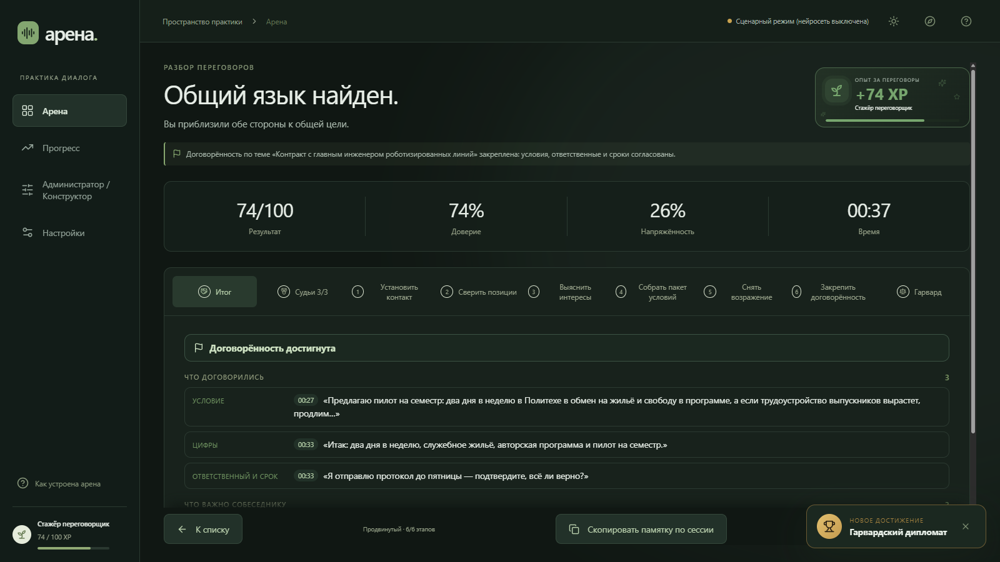 |
| Разбор: три судьи | 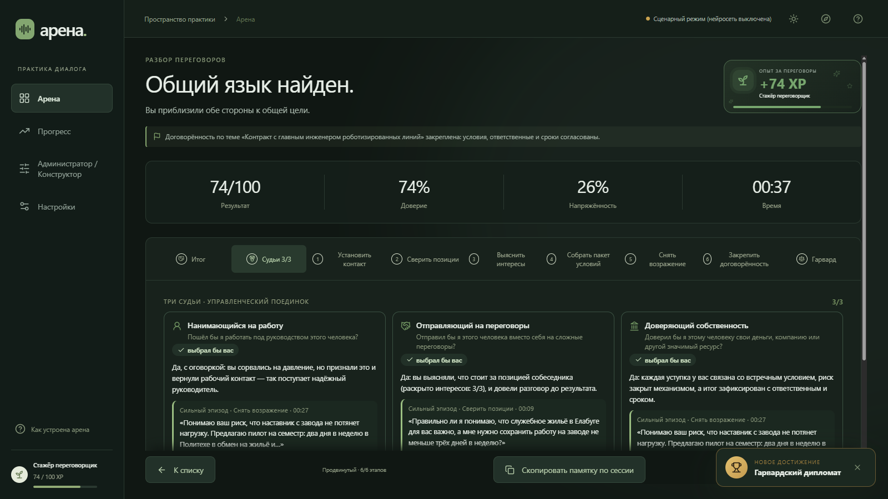 |
| Разбор хода | 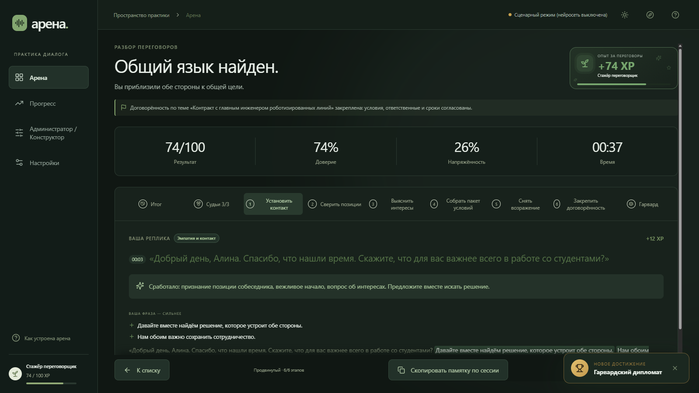 |
| Прогресс: XP, звания, достижения | 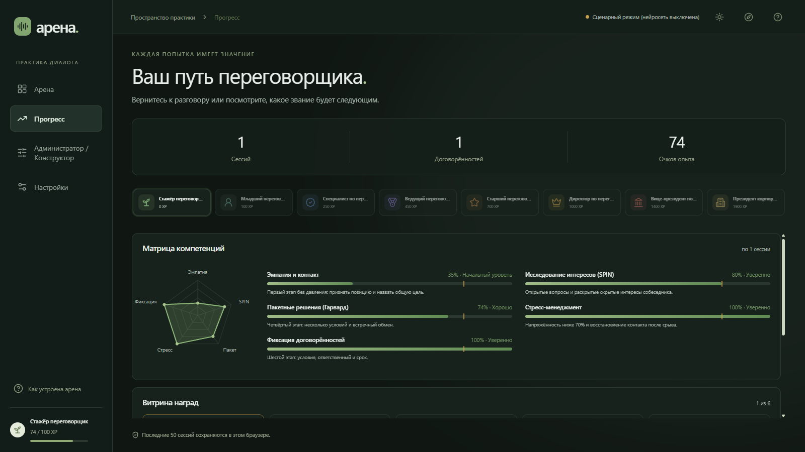 |
| Администратор / Конструктор | 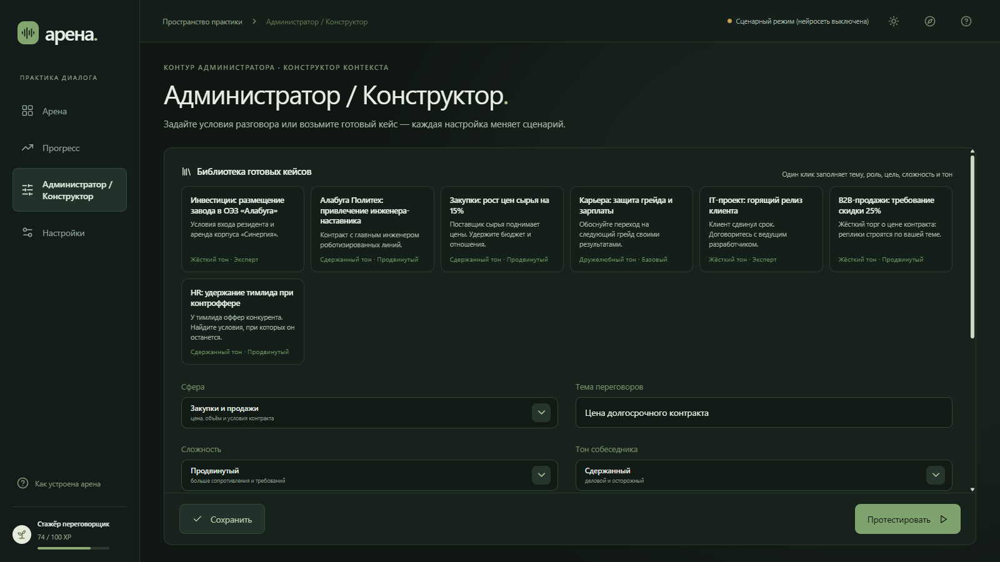 |
| Настройки и локальная нейросеть | 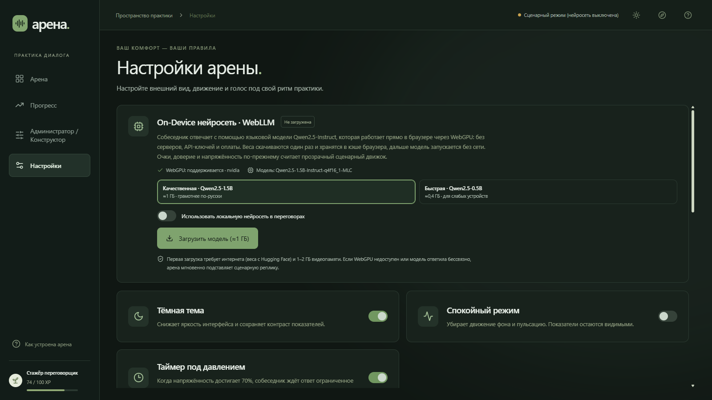 |
| Мобильная версия (390×844) | 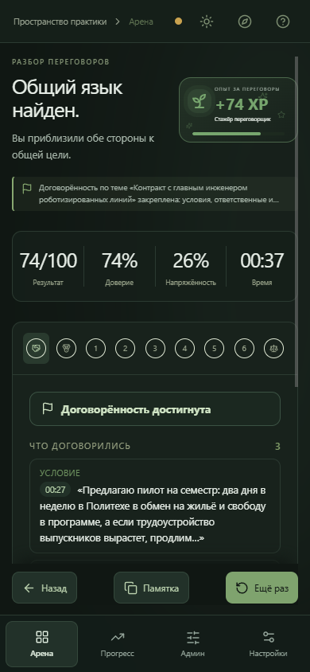 |

## Схема работы

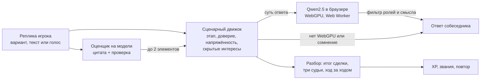

## Прочее

- [README](../README.md) — полное описание функций и запуск.
- [docs/browser-smoke.py](browser-smoke.py) — сквозная браузерная проверка.
- Страница-презентация на сайте: https://lotos24.github.io/arenaAI-26/presentation/
